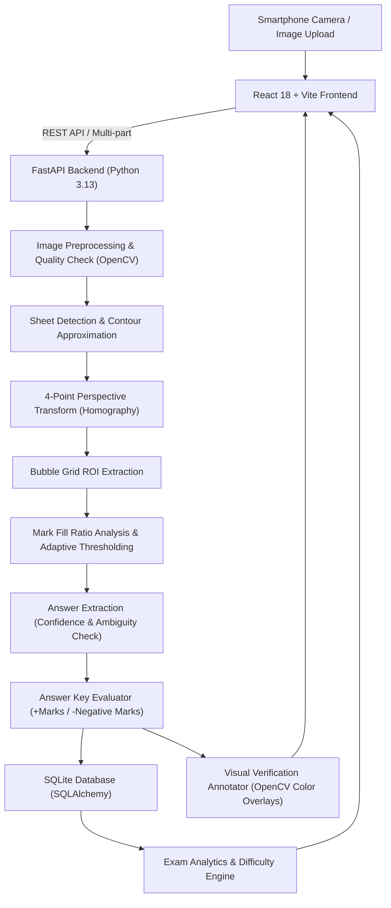

# Smart OMR — AI-Powered Smartphone OMR Scanner

> *"Turn Any Smartphone into an OMR Scanner."*

Smart OMR is a production-quality, computer-vision-powered web application that allows educational institutions, schools, colleges, coaching centres, and examination departments to scan and evaluate standard OMR answer sheets using an ordinary smartphone camera or uploaded photograph.

It completely eliminates the need for expensive, dedicated OMR optical hardware.

---

## 1. System Architecture



---

## 2. Key Features

- **Smartphone Camera Scanning**: Use the in-browser HTML5 Camera API with an interactive viewfinder and alignment framing guide.
- **Perspective & Homography Correction**: Corrects skewed, angled, and rotated photographs taken in hand or on a desk.
- **Lighting & Noise Normalization**: Uses CLAHE and background division normalization to flatten shadows and uneven lighting.
- **Deterministic Computer Vision Pipeline**: Relies on true image processing (OpenCV, NumPy) rather than non-deterministic LLM guessing.
- **Ambiguous & Unanswered Mark Detection**: Detects multiple filled bubbles and flags them for manual review rather than guessing blindly.
- **Confidence Scoring**: Computes fill-gap confidence (0–100%) for every detected bubble.
- **Visual OMR Verification**: Color-coded overlay on the rectified sheet (Green = Correct, Red = Wrong, Blue Ring = Answer Key, Yellow = Ambiguous).
- **Batch Evaluation**: Upload whole class sets and generate downloadable CSV reports.
- **Diagnostic Analytics**: Exam-wide statistics (average, highest, lowest, pass %) and question-level difficulty signals.
- **Printable OMR Templates**: Generates high-resolution standard 20 and 50-question sheets in A4 PDF and PNG formats.
- **Interactive 1-Click Demo Mode**: Built-in benchmark presets for judges (Clean scan, Tilted photo, Low light, Partial marks, Ambiguous marks).

---

## 3. Technology Stack

- **Frontend**: React 18, Vite, Tailwind CSS, Lucide Icons, Axios, HTML5 Camera API.
- **Backend**: Python 3.13, FastAPI, Uvicorn, SQLAlchemy ORM, Pydantic v2.
- **Computer Vision**: OpenCV (headless), NumPy, Pillow.
- **Database**: SQLite (architectured for PostgreSQL / MySQL).
- **Reporting**: ReportLab (vector PDF generation) & CSS Print views.

---

## 4. Project Directory Layout

```
smart-omr/
├── backend/
│   ├── app/
│   │   ├── api/
│   │   │   ├── exams.py          # Exam CRUD and Answer Key endpoints
│   │   │   ├── omr.py            # Single and Batch scanning endpoints
│   │   │   └── analytics.py      # Results and item difficulty analytics
│   │   ├── cv/
│   │   │   ├── preprocessing.py   # Grayscale, CLAHE, blur, brightness checks
│   │   │   ├── sheet_detection.py # Canny edge & contour quad detection
│   │   │   ├── perspective.py     # 4-point homography transform
│   │   │   ├── bubble_detection.py# Template geometry & ROI locator
│   │   │   ├── mark_detection.py  # Adaptive fill ratio & ambiguity detector
│   │   │   ├── evaluator.py       # Scoring (+marks, -negative marks)
│   │   │   ├── visualizer.py      # Color overlay verification annotator
│   │   │   └── template_generator.py # Master template generator (PDF & PNG)
│   │   ├── database/
│   │   │   └── session.py        # SQLAlchemy SQLite engine
│   │   ├── models/
│   │   │   └── schema.py         # Database ORM models
│   │   ├── schemas/
│   │   │   └── schemas.py        # Pydantic schemas
│   │   └── main.py               # FastAPI entry point & static mounts
│   ├── seed_demo_data.py         # Demo exam and sample images seeder
│   ├── requirements.txt          # Frozen backend dependencies
│   └── .env.example              # Environment variables template
├── frontend/
│   ├── src/
│   │   ├── components/
│   │   │   ├── Navbar.jsx        # Navigation bar with live health indicator
│   │   │   ├── CameraScanner.jsx # Smartphone camera scanner with alignment frame
│   │   │   ├── PipelineVisualizer.jsx # 7-stage CV pipeline progress cards
│   │   │   └── VisualVerificationModal.jsx # Full-screen overlay inspector
│   │   ├── pages/
│   │   │   ├── Dashboard.jsx     # Teacher dashboard with metrics & recent exams
│   │   │   ├── ScanOMR.jsx       # Real-time scan and evaluation view
│   │   │   ├── BatchScan.jsx     # Multi-sheet processor with CSV export
│   │   │   ├── CreateExam.jsx    # Exam configuration form
│   │   │   ├── AnswerKeyEditor.jsx # Fast 50-Q matrix editor & CSV import
│   │   │   ├── ExamAnalytics.jsx # Question difficulty & pass rate analytics
│   │   │   ├── DemoMode.jsx      # 1-click live benchmark presenter
│   │   │   └── PrintTemplates.jsx# Downloadable official A4 OMR sheets
│   │   ├── App.jsx               # Main React application
│   │   └── index.css             # Tailwind styling and custom themes
├── omr_templates/                # Master printable PDF & PNG sheets
├── sample_data/                  # Benchmark test images for demo mode
├── tests/                        # Automated pytest suite (Unit & CV integration)
├── run_backend.bat               # Backend startup script
└── run_frontend.bat              # Frontend startup script
```

---

## 5. Getting Started & Deployment

### Quick Start (Unified Single-Service Mode)
In production, FastAPI serves both the REST API and the compiled React SPA on a single port (`:8000`).

#### A. One-Command Docker Deployment
```bash
docker compose up -d --build
```
Open `http://localhost:8000` in your browser.

#### B. Local Development Mode (Windows)
1. **Start Backend**: Run `run_backend.bat` (Port 8000)
2. **Start Frontend**: Run `run_frontend.bat` (Port 5173 with hot reloading)

For full cloud deployment instructions (Render, Railway, Fly.io, AWS, Ubuntu VPS), see **[DEPLOYMENT.md](docs/DEPLOYMENT.md)**.

---

## 6. API Documentation

| Method | Endpoint | Description |
|---|---|---|
| `GET` | `/api/health` | Health status and OpenCV version |
| `POST` | `/api/exams` | Create a new examination |
| `GET` | `/api/exams` | List all examinations |
| `GET` | `/api/exams/{id}` | Get exam details and answer key |
| `POST` | `/api/exams/{id}/answer-key` | Save / update answer key |
| `POST` | `/api/omr/scan` | Upload and evaluate an OMR sheet photograph |
| `POST` | `/api/omr/batch` | Upload and evaluate multiple sheets simultaneously |
| `GET` | `/api/results/{id}` | Retrieve detailed score breakdown and overlay image |
| `GET` | `/api/exams/{id}/analytics` | Overall pass rate and question-by-question difficulty |
| `GET` | `/api/demo/samples` | List pre-generated benchmark sample images |
| `GET` | `/api/omr/templates` | List printable PDF and PNG templates |

---

## 7. Running the Automated Tests

To run the full suite of unit and computer vision integration tests:
```bash
cd backend
.venv\Scripts\pytest.exe ..\tests -v
```

All 8 automated tests verify:
- Backend health and database connectivity.
- Exam and answer key CRUD.
- High-resolution template generation and geometry integrity.
- Perspective rectification on skewed (~20° tilted) photographs.
- Bubble fill classification (correct, wrong, unanswered, and ambiguous multiple marks).
- Marking formulas (positive marks, negative marks, percentages).
- End-to-end API upload and JSON response validation.

---

## 8. Hackathon Judge Presentation Q&A

### Why OpenCV instead of an LLM?
Controlled OMR forms require deterministic pixel-level precision. An LLM cannot reliably determine sub-pixel coordinate bounding boxes or perform exact mathematical homography transformations. OpenCV gives reproducible, millisecond-fast evaluation that never hallucinates.

### How do you handle tilted smartphone photos?
We use Canny edge detection and polygon approximation to identify the sheet boundary or corner fiducial markers. We then compute a 3x3 perspective transformation matrix (`cv2.getPerspectiveTransform`) and warp the skewed image into an upright, normalized 1500×2000 canvas.

### How do you handle uneven lighting and shadows?
We apply CLAHE (Contrast Limited Adaptive Histogram Equalization) combined with morphological background division normalization to flatten shadow gradients before adaptive Gaussian thresholding.

### What happens when two bubbles are marked?
Rather than guessing blindly, the system detects multiple filled bubbles (fill difference < ambiguity threshold) and marks the question as `AMBIGUOUS`. This question receives 0 marks and is explicitly flagged for teacher review in the results table.
