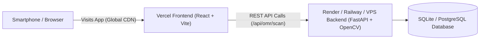

# Deploying Smart OMR to Vercel

You can deploy the **Smart OMR Frontend** to **Vercel** right now in under 2 minutes!

---

## 1. Architecture Overview for Vercel



> [!NOTE]
> **Why separate Frontend (Vercel) and Backend (Render / VPS)?**
> - **Vercel** is the gold standard for hosting React/Vite frontends with global edge CDNs and free custom domains.
> - The **Backend** uses **OpenCV**, which requires native C++ graphics libraries (`libgl1`, `libglib`) and persistent disk storage for uploaded OMR sheet images and SQLite databases. Vercel's serverless functions have a 250MB size limit and ephemeral file systems (files are wiped after each request).
> - Therefore, the industry-standard architecture is:
>   - **Frontend**: Hosted on **Vercel**
>   - **Backend**: Hosted on **Render.com** (Free) or **Railway.app** using our included `Dockerfile`.

---

## 2. Step-by-Step Vercel Deployment (2 Minutes)

### Step 1: Push Code to GitHub / GitLab
Make sure your `smart-omr` code is pushed to your GitHub repository.

### Step 2: Import into Vercel
1. Go to [Vercel Dashboard](https://vercel.com/new) and sign in.
2. Click **Add New...** &rarr; **Project**.
3. Import your GitHub repository.

### Step 3: Configure Project Settings in Vercel
In the project configuration screen:
- **Framework Preset**: `Vite` (automatically detected)
- **Root Directory**: Click **Edit** and choose `frontend`
- **Build Command**: `npm run build`
- **Output Directory**: `dist`

### Step 4: Add Backend Environment Variable
Under **Environment Variables**, add:
- **Key**: `VITE_API_URL`
- **Value**: `https://your-backend-service.onrender.com` *(The URL of your deployed backend, or leave blank if testing locally)*

### Step 5: Click Deploy!
Vercel will build your project in ~30 seconds and provide a live production URL:
```
https://smart-omr.vercel.app
```

---

## 3. Deploying the Backend on Render (Free, 3 Minutes)

To pair your Vercel frontend with a live backend:

1. Sign up at [Render.com](https://dashboard.render.com).
2. Click **New +** &rarr; **Web Service**.
3. Connect your GitHub repository.
4. Set:
   - **Name**: `smart-omr-backend`
   - **Runtime**: `Docker`
   - **Root Directory**: `smart-omr` (or root)
   - **Instance Type**: Free
5. Click **Create Web Service**.
6. Render will automatically build the `Dockerfile` (installing OpenCV, NumPy, FastAPI) and give you a public backend URL:
   ```
   https://smart-omr-backend.onrender.com
   ```
7. Copy this URL and paste it into your Vercel `VITE_API_URL` environment variable.

---

## 4. Testing Your Vercel Deployment

Once deployed:
1. Open your Vercel URL on your **smartphone** (`https://smart-omr.vercel.app`).
2. Tap **Scan OMR** &rarr; **Start Camera**.
3. Allow camera permissions, point at any printed sheet, and tap **Capture Photo**.
4. The image will be processed by the OpenCV backend, returning the rectified visual verification overlay and evaluated score in seconds!
